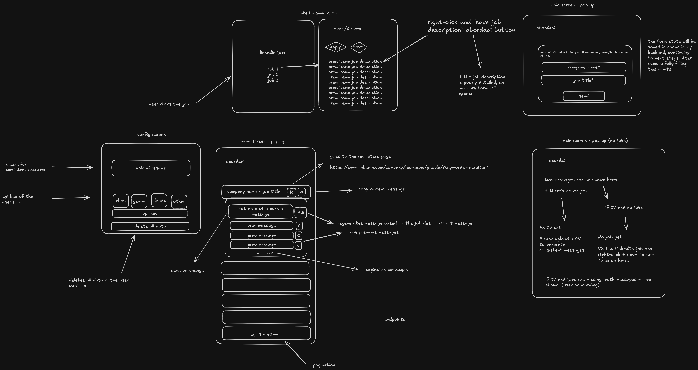
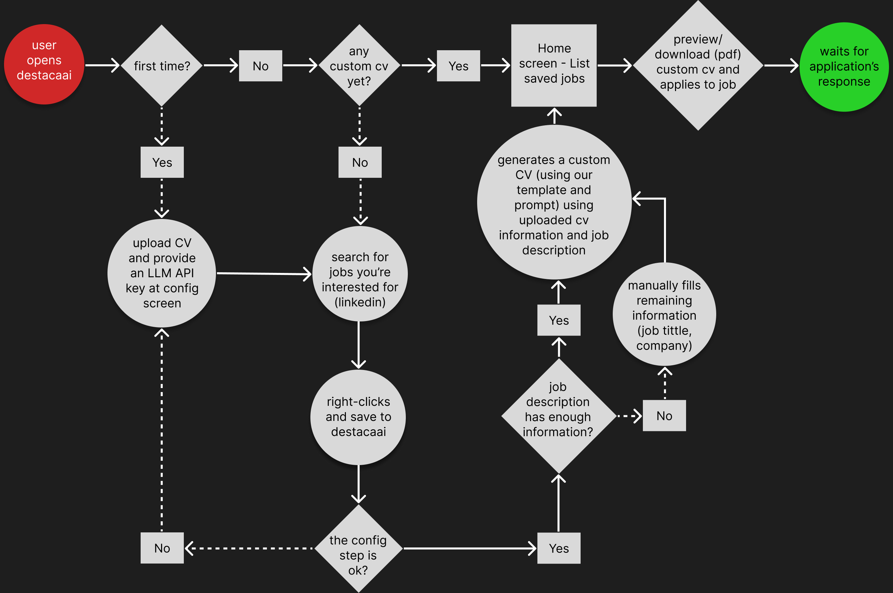
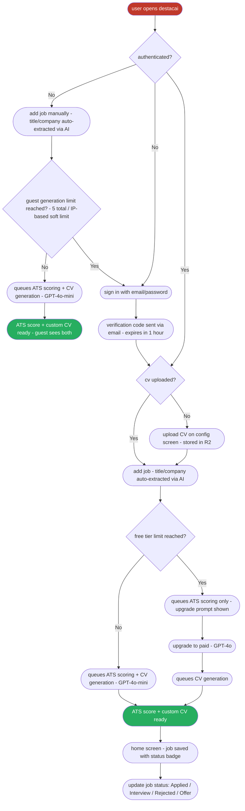

# DestacAI

DestacAI is a Chrome extension micro-SaaS that generates a custom CV for each job you apply to, optimized for ATS filters, with a built-in score that tells you exactly why your current CV isn't making the cut.

# Problem

Sometimes you're a skilled developer with great side projects and experience, however, still not getting the job you wanted. That happens with all of us. The problem is not you, it's how you're showing it. Nowadays companies are using AI ATS (Applicant Tracking System), automatically filtering you for not using specific keywords related to the job requirements.

Even though you're aware of those filtering methods and manually customize your CV for the position you want, how much time per day can you realistically spend doing this?

# Solution

DestacAI reads the job description directly from LinkedIn, scores your current CV against it (0–100), and generates a tailored version that passes ATS filters - all without leaving your browser.

Template created by DevCelio: https://github.com/celiobjunior/resume-template

# Project

At the beginning, I wanted to create a solution for the step after the application: How could you reach out the recruiters responsible for that position in order to stand out? Premium LinkedIn users can send AI-generated messages directly to recruiters, giving them an enormous advantage over other candidates. You can find recruiters without premium, but it's hard to know how to approach them. Should the message be friendly? Professional? About previous experiences? How do you show interest without looking desperate?

Even with tools like Claude, Gemini or ChatGPT available, it's easy to lose track of what you sent and whether it's consistent with your information.

This is the first sketch I did for the project.


The idea was pretty much the same as now, a Chrome extension that automatically reads job descriptions, finds the company's recruiters on LinkedIn, and generates a personalized outreach message based on your CV, keeping your approach consistent across every application. The problem was that I wouldn't know who's specifically responsible for the position and even though I knew, how long would take for the person to accept the connection invitation? How could this be tracked?

While thinking on how to address those problems, I had an even better idea: What if I pivot my solution to the previous step?

Based on this new idea, I created this User Flow using Figma:


Then I evolved the project to include a full backend, authentication, ATS scoring, and a paid tier based on model quality:



## Functional Requirements

- User uploads their CV once, stored securely in the backend
- User signs in with email/password using custom auth logic
- Sign-up triggers a verification code sent via Brevo, expires in 1 hour
- Forgot password also sends a verification code to the user's email via Brevo
- Adding a job automatically queues both ATS scoring and CV generation
- ATS scoring is always free with no generation limit
- CV generation is subject to tier limits (5/month on free, unlimited on paid); if the limit is reached, ATS scoring still runs and the user is shown an upgrade prompt
- Free tier uses GPT-4o-mini; paid tier uses GPT-4o
- Jobs are synced across devices via backend persistence
- Each job has a status badge: Applied / Interview / Rejected / Offer
- User can delete individual jobs or clear all data
- Saving the same job twice is prevented by checking the job ID
- Config auto-saves without a Save button

## Tiers

| Feature                       | Guest (unauthenticated)   | Free                   | Paid                                          |
| ----------------------------- | ------------------------- | ---------------------- | --------------------------------------------- |
| ATS score (0–100)             | After CV generation       | Unlimited              | Unlimited                                     |
| CV generation                 | 5 total (IP soft-limited) | 5 / month              | Unlimited                                     |
| Auto title/company extraction | Yes (auto, on job add)    | Yes (auto, on job add) | Yes (manual "Extract with AI" also available) |
| LLM model                     | GPT-4o-mini               | GPT-4o-mini            | GPT-4o                                        |
| Multi-device sync             | No                        | Yes                    | Yes                                           |
| Job status badge              | No                        | Yes                    | Yes                                           |

## Non-Functional Requirements

- Extension only works on LinkedIn job posting pages
- Only Chrome is supported
- CV upload format: PDF, max 10MB
- CV files stored in Cloudflare R2
- Jobs and metadata stored in Postgres
- CV generation is queued via BullMQ, handled by a background worker
- Expected CV generation time: under 30 seconds with GPT-4o-mini; up to 60 seconds with GPT-4o
- Transactional emails (verification code, password reset) sent via Brevo
- Guest CV generation is limited to 5 total per `guestId`; a secondary IP-based check blocks further generations if the same IP is seen with more than `IP_GUEST_LIMIT` distinct guestIds within 24 hours (default: 3)
- `GET /users/me` accepts both Bearer JWT and `X-Guest-Id` so guests see their live generation count; `POST /users/me` (email upsert) stays JWT-only
- Backend `npm run build` runs `rm -rf dist && tsc && tsc-alias && cp src/assets/*.md dist/assets/` — the clean step prevents stale compiled files from a previous folder layout, the copy step is needed because Nixpacks (Railway's default builder) doesn't run the Dockerfile's separate copy command and `tsc` only emits TypeScript output

---

## Architecture

### Backend

```
Chrome Extension (React + TypeScript + Vite)
  └── Custom auth (email/password, JWT-based session)
  └── React Query (all server state - no raw fetch)

Backend (Hono on Railway)
  ├── API service     - auth middleware, REST endpoints, Stripe webhooks
  ├── Worker service  - BullMQ consumer, CV generation, ATS scoring, R2 uploads
  └── Brevo           - transactional emails (verification code, password reset)

Infrastructure
  ├── Redis (Railway addon)     - BullMQ job queue
  ├── Postgres (Railway addon)  - jobs, users, subscription state
  └── Cloudflare R2             - CV PDF file storage
```

**Backend folder structure (feature-based):**

```
src/
├── features/
│   ├── auth/        # router, controller, service, repository, dto, model
│   ├── jobs/        # router, controller, service, repository, dto, model
│   │                # ↑ owns ATS scoring triggers and CV generation triggers
│   ├── cv/          # router, controller, service, dto, model
│   ├── users/       # router, controller, service, repository, dto, model
│   └── stripe/      # router, controller, service
├── workers/         # cvProcessor, atsProcessor, guestCleanup
├── db/              # schema, client, migrations
├── lib/             # llm, r2, redis, jwt, pdf, queue — pure infrastructure
└── shared/          # shared Zod schemas, error types
```

Each feature's `model.ts` defines the TypeScript domain types for its entities (e.g. `Job`, `User`). Repositories map Drizzle rows to these types; services consume them. This keeps business logic decoupled from the ORM schema.

### Component Structure

Components are split by feature. Shared components are reused across features.

**Rules:**
- **Components are pure UI** — no API calls, no business logic. Props in, JSX out.
- **Hooks own all logic** — mutations, queries, validation, navigation, toasts.
- **`api.ts` per feature** — the only file that calls axios within a feature.
- **`shared/utils/`** — pure functions with no side effects, no React, no axios.
- **One query per resource** — `/jobs` returns each row with status, ATS scores, and generation state populated. No per-row endpoints; one polling stream is the truth.

```
src/
├── features/
│   ├── auth/
│   │   ├── components/    # pure UI — SignInForm, SignUpForm, GuestLimitModal, etc.
│   │   ├── hooks/         # useSignIn, useSignUp, useVerifyCode, useResetPassword, useMigrateGuest
│   │   ├── stores/        # auth.ts (Zustand)
│   │   ├── schemas.ts     # Zod schemas used with React Hook Form
│   │   └── api.ts         # all auth requests (axios)
│   ├── jobs/
│   │   ├── components/    # pure UI — JobList, JobItem, AddJob, NoCvState, EmptyState
│   │   ├── hooks/         # useJobs, useCreateJob, useDeleteJob, useUpdateJobStatus, useDownloadCV
│   │   ├── schemas.ts
│   │   └── api.ts         # all job + generation requests (ATS data carried by /jobs)
│   └── config/
│       ├── components/    # pure UI — ConfigForm, CVUpload
│       ├── hooks/         # useUser, useUploadCV, useDeleteCV
│       └── api.ts         # cv upload, checkout requests
├── shared/
│   ├── components/        # Button, IconButton, Input, Spinner, NavBar
│   ├── utils/             # pure utility functions (formatters, helpers, etc.)
│   └── constants.ts
└── lib/                   # apiClient.ts, queryClient.ts, chromeStorageClient.ts, localStorageClient.ts
```

### State Management

Three layers, each with a clear scope:

- **Zustand** — auth state and any cross-component app state that isn't server data (e.g. modals, flags that outlive a single component).
- **React Query** — all server state. No raw `fetch`, no `useEffect` for data fetching. Handles caching, background refetching, loading and error states. Mutations write optimistically where safe (status changes, deletes) via `onMutate` + rollback on error; CV upload/delete use `setQueryData` instead of `invalidateQueries` to skip the redundant refetch.
- **React Hook Form + Zod** — all form state. Components register fields; hooks own the submit handler and wire it to a React Query mutation.

---

## Trade-offs

### LLM cost model

Users no longer provide their own API key. The backend selects the model based on the user's subscription tier. Free users get GPT-4o-mini (fast, low cost). Paid users get GPT-4o. This removes signup friction and creates a clear, felt quality difference between tiers rather than a pure feature gate.

### Queue over inline generation

CV generation is enqueued via BullMQ rather than handled inline. This lets the worker process jobs asynchronously (25 jobs/min), retry on transient failures, and scale independently from the API. The trade-off is added complexity over a simple HTTP call, but it's necessary for reliable async processing.

### Serverless ruled out

CV generation can take 30–60 seconds. Serverless functions on most platforms time out at 10–30 seconds. A persistent Railway worker service avoids this entirely without the operational overhead of AWS ECS or similar.

### Cloudflare R2 over MinIO or Supabase Storage

R2 offers 10GB storage and 1M operations/month free with no egress fees and an S3-compatible API. MinIO requires self-hosting a stateful service. Supabase Storage's free tier caps at 1GB with egress costs. R2 is the lowest-ops, lowest-cost option at all scales.

### Custom auth over Clerk

Clerk was the original choice and ships `@clerk/chrome-extension` specifically for extensions. In practice, the package had compatibility issues with the Chrome extension environment that couldn't be worked around. The project now uses custom email/password auth: hashed passwords, JWT-based sessions, and verification codes sent via Brevo for both sign-up and password reset.

### CV generation approach

The LLM returns structured JSON validated against a Zod schema. The worker renders the PDF server-side using `@react-pdf/renderer` and returns it to the extension for download. Both LLM call and PDF generation happen on the backend.

### One endpoint per resource

`/jobs` already returns each row with `atsStatus`, `atsScore`, `generatedCvAtsStatus`, and `generatedCvAtsScore` populated. The extension reads both ATS tracks directly from a single polling stream rather than pulling each job's score from a separate `/jobs/:jobId/ats` endpoint. Cuts request volume from N+1 polls per cycle (where N = pending jobs) down to a single `/jobs` poll, regardless of job count. The re-queue safety net for stuck tailored ATS jobs lives inside `listJobs` now and fires on every poll, so a failed enqueue doesn't leave a row stuck in `idle`.

### Optimistic mutations

Status changes and deletes write to the React Query cache via `onMutate` and roll back on error. The cache can briefly disagree with the server on slow networks, but the status badge moves the instant a button is clicked instead of 200–500ms after. CV upload/delete use `setQueryData` to skip the redundant refetch a plain `invalidateQueries` would trigger.

### Re-extract from R2 instead of passing CV text

The CV worker could pass the text it built from the LLM output to the ATS worker through the queue payload, saving a PDF parse. It doesn't. The ATS worker always reads the just-rendered PDF from R2 and extracts its text — same path used for uploaded CVs. Costs ~hundreds of milliseconds per scoring; gained: a single source of truth (the actual PDF the user downloads), no DB column to persist text, no queue field to keep in sync.

### Live counter without a persistent layout

The generations counter sits inside the `/config` page rather than the global NavBar. Keeping it scoped to one page avoids cluttering the chrome of every screen, and React Query still updates it the moment a CV completes: `useJobs` watches for any row transitioning `cvGenerationStatus → 'done'` and calls `qc.refetchQueries` on the user query. `refetchQueries` (not `invalidateQueries`) so the user profile refreshes even when no `useUser` observer is currently mounted — the counter is correct on the next visit to `/config` without waiting for `staleTime` to expire.

---

## Libraries

**Extension:**

- **Custom auth** - email/password with JWT sessions, verification codes, and password reset via Brevo
- **Zustand** - app-level state (auth, cross-component flags, modals)
- **React Query** - server state, caching, background sync
- **React Hook Form + Zod** - form state and schema validation; components register fields, hooks own submission
- **Tailwind CSS v4** - utility-first styling
- **Framer Motion** - animations and page transitions
- **React Router DOM** - in-extension navigation
- **Lucide React** - icons
- **React Hot Toast** - notifications

**Backend (Hono on Railway):**

- **Hono** - TypeScript-first web framework
- **BullMQ** - Redis-backed job queue for CV generation and ATS scoring
- **Vercel AI SDK** - LLM provider abstraction (OpenAI GPT-4o-mini / GPT-4o)
- **Brevo** - transactional email API for verification codes and password reset
- **@react-pdf/renderer** - server-side PDF generation from structured CV data
- **pdfjs-dist** - PDF text extraction from uploaded CVs
- **@aws-sdk/client-s3** - Cloudflare R2 file upload/download (S3-compatible)
- **Stripe** - subscription management and webhooks
- **Drizzle ORM** - type-safe Postgres queries

---

## How CV Generation Works

The user clicks a LinkedIn job description in the browser. The content script captures the text and sends it to the backend. The backend enqueues a BullMQ job. The worker fetches the user's CV from R2, extracts its text with `pdfjs-dist`, and calls the LLM with the CV text and job description as context.

The LLM acts as an experienced technical recruiter and follows a strict set of rules:

- **Action verbs** - a curated list of strong, specific verbs
- **Writing style** - should and avoid pattern with a list of avoided words
- **Do's and Don'ts** - explicit rules the model must follow
- **Top 5 resume mistakes** - injected as negative examples so the model learns what to avoid
- **Candidate profile** - the uploaded CV is included as context so the model only adapts existing experience, never invents or exaggerates

The LLM returns structured JSON validated against a Zod schema. The worker renders the PDF server-side via `@react-pdf/renderer` and returns it to the extension for download.

## How ATS Scoring Works

The ATS check runs as a separate, lighter LLM call, always free, no generation limit. When a job is added, ATS scoring is automatically enqueued alongside CV generation. The model compares the job description keywords and requirements against the user's current CV and returns a score from 0 to 100 with a plain-language explanation of what's missing. A second ATS score is also computed after CV generation completes, so the user can compare their original CV score against the generated one.

Both tracks (`uploaded` and `generated`) share the same worker and the same `scoreCV` function — only the R2 key differs. Scores and explanations are written back onto the job row, so the extension reads them straight from `/jobs` without a dedicated ATS endpoint. If a row ever shows `cvGenerationStatus === 'done'` with `generatedCvAtsStatus === 'idle'` (e.g. the queue add failed between two operations), the next `/jobs` poll re-enqueues the tailored ATS job automatically.

